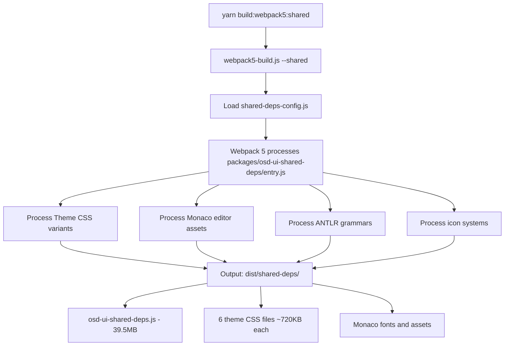
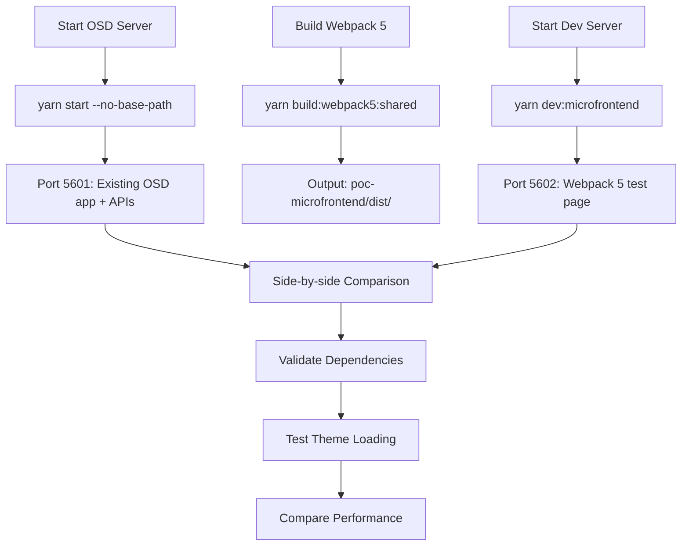

# OpenSearch Dashboards - Webpack 5 Micro-Frontend PoC

## Overview

This directory contains a Proof of Concept (PoC) implementation of Webpack 5 + Module Federation for OpenSearch Dashboards, running parallel to the existing webpack 4 build system. The PoC demonstrates how to build OSD's complex shared dependencies, themes, and plugins using webpack 5 while reusing all existing source code.

## Directory Structure

```
poc-microfrontend/
├── webpack5-optimizer/          # Parallel build system to packages/osd-optimizer
│   ├── src/
│   │   └── shared-deps-config.js # Webpack 5 config for shared dependencies
│   ├── package.json             # Webpack 5 build dependencies
│   └── test-build.js            # Direct webpack 5 testing script
├── dev-server/                  # Micro-frontend development server
│   └── src/
│       └── index.html           # Test page with dependency validation
├── scripts/                     # Build and development scripts
│   ├── webpack5-build.js        # Main build orchestration script
│   └── webpack5-dev-server.js   # Development server (port 5602)
└── dist/                        # Build output directory
    └── shared-deps/             # Webpack 5 built shared dependencies
        ├── osd-ui-shared-deps.js        # Main shared bundle (39.5MB)
        ├── osd-ui-shared-deps.v*.css    # Theme CSS bundles (6 variants)
        ├── fonts/                       # Monaco editor fonts
        └── *.js                         # Individual icon modules
```

## How It Works

### Build System Architecture

The PoC creates a **parallel build system** that reuses existing OSD source code:

1. **Existing System** (unchanged): `packages/osd-optimizer` builds with webpack 4
2. **New System** (PoC): `poc-microfrontend/webpack5-optimizer` builds same code with webpack 5

### Key Innovation: Code Reuse

Instead of creating separate code, the webpack 5 system **builds existing OSD code**:
- **Shared Dependencies**: Builds `packages/osd-ui-shared-deps/entry.js` with webpack 5
- **Themes**: Processes same theme CSS files as existing system
- **Assets**: Handles Monaco editor and ANTLR grammars from existing packages

## Yarn Commands

### `yarn build:webpack5:shared`

**Purpose**: Build OSD shared dependencies using webpack 5
**Location**: Runs from repository root
**What it does**:
1. Executes `poc-microfrontend/scripts/webpack5-build.js --shared`
2. Loads webpack 5 configuration from `webpack5-optimizer/src/shared-deps-config.js`
3. Builds `packages/osd-ui-shared-deps/entry.js` using webpack 5
4. Processes all theme CSS variants (v7/v8/v9 × light/dark)
5. Handles Monaco editor assets, ANTLR grammars, icon systems
6. Outputs to `poc-microfrontend/dist/shared-deps/`

**Command Flow**:
```bash
yarn build:webpack5:shared
  ↓
scripts/use_node poc-microfrontend/scripts/webpack5-build.js --shared
  ↓
webpack5-build.js loads shared-deps-config.js
  ↓
Webpack 5 processes packages/osd-ui-shared-deps/entry.js
  ↓
Outputs: osd-ui-shared-deps.js + theme CSS bundles
```

**Build Time**: ~46 seconds
**Output Size**: 39.5MB main bundle + 6 theme CSS files (~720KB each)

### `yarn dev:microfrontend`

**Purpose**: Start micro-frontend development server for testing
**Location**: Runs from repository root
**What it does**:
1. Executes `poc-microfrontend/scripts/webpack5-dev-server.js`
2. Starts HTTP server on port 5602
3. Serves HTML test page from `dev-server/src/index.html`
4. Serves webpack 5 built assets from `dist/shared-deps/`
5. Provides CORS headers for cross-origin requests

**Server Endpoints**:
- `http://localhost:5602/` - HTML test page
- `http://localhost:5602/shared-deps/osd-ui-shared-deps.js` - Main webpack 5 bundle
- `http://localhost:5602/shared-deps/osd-ui-shared-deps.v8.light.css` - Theme CSS
- All other built assets available under `/shared-deps/`

### `yarn build:webpack5:core` (TODO)

**Purpose**: Build OSD core application using webpack 5
**Planned Behavior**:
1. Build `src/core/public/` source code with webpack 5
2. Generate core bundle with Module Federation remote capability
3. Enable core services to be loaded as federated module

### `yarn build:webpack5:plugins` (TODO)

**Purpose**: Build OSD plugins using webpack 5 + Module Federation
**Planned Behavior**:
1. Build existing plugins from `src/plugins/` with webpack 5
2. Convert plugins to Module Federation remote modules
3. Enable runtime plugin loading and communication

### `yarn build:webpack5`

**Purpose**: Build all components (shared, core, plugins) with webpack 5
**Current Behavior**: Only builds shared dependencies (others TODO)

## Development Servers

### 1. OSD Development Server (Port 5601)

**Purpose**: Existing OSD server for comparison and API access
**Start Command**: `yarn start --no-base-path`
**What it serves**:
- Complete OSD application with existing webpack 4 bundles
- Server APIs (`/api/status`, `/api/core/capabilities`, etc.)
- Plugin endpoints and saved object APIs
- Theme and configuration data

**Usage**: Baseline comparison and API provider for PoC integration

### 2. Webpack 5 Dev Server (Port 5602)

**Purpose**: Test webpack 5 micro-frontend bundles
**Start Command**: `yarn dev:microfrontend`
**Implementation**: `poc-microfrontend/scripts/webpack5-dev-server.js`

**How It Works**:
```javascript
// Simple HTTP server with route handling
const server = http.createServer((req, res) => {
  const pathname = parsedUrl.pathname;
  
  // Route: / or /index.html
  if (pathname === '/' || pathname === '/index.html') {
    serveFile(HTML_FILE, res);  // Serve test page
    return;
  }
  
  // Route: /shared-deps/*
  if (pathname.startsWith('/shared-deps/')) {
    const fileName = pathname.replace('/shared-deps/', '');
    const filePath = path.resolve(DIST_DIR, 'shared-deps', fileName);
    serveFile(filePath, res);  // Serve webpack 5 built assets
    return;
  }
  
  // 404 for everything else
});
```

**What it serves**:
- **HTML Test Page**: Loads and validates webpack 5 shared dependencies
- **Webpack 5 Assets**: All built bundles, CSS themes, fonts, icons
- **CORS Support**: Cross-origin headers for micro-frontend loading

**Key Features**:
- **MIME Type Detection**: Proper content types for JS, CSS, fonts
- **Static File Serving**: Direct file system access to built assets
- **Request Logging**: Console output for all requests
- **Graceful Shutdown**: Ctrl+C handling

## Build Process Flow

### Shared Dependencies Build



### Development Workflow



## Webpack 5 Configuration Details

### `shared-deps-config.js`

**Adapted from**: `packages/osd-ui-shared-deps/webpack.config.js`

**Key Changes for Webpack 5**:

1. **Entry Points**: Same as existing system
   ```javascript
   entry: {
     'osd-ui-shared-deps': './entry.js',
     'osd-ui-shared-deps.v7.dark': ['@elastic/eui/dist/eui_theme_dark.css'],
     'osd-ui-shared-deps.v7.light': ['@elastic/eui/dist/eui_theme_light.css'],
     // ... all theme variants
   }
   ```

2. **Output Configuration**: Webpack 5 compatible
   ```javascript
   output: {
     library: '__osdSharedDeps__',     // Same global name
     libraryTarget: 'var',            // Webpack 4 compatible syntax
     publicPath: '/',                 // Static serving
     // Removed custom hash function for compatibility
   }
   ```

3. **Module Rules**: Adapted for webpack 5
   - **Asset Handling**: Using `file-loader` instead of webpack 5 `asset/resource` for compatibility
   - **CSS Processing**: Same loaders but updated configuration
   - **Babel Processing**: Identical to existing system for Monaco/ANTLR

4. **Optimizations**: Simplified for PoC
   ```javascript
   optimization: {
     splitChunks: false,  // Disabled for initial testing
     // Module Federation will handle chunking later
   }
   ```

### Public Path Handling

**Issue Resolved**: Original config used `UiSharedDeps.publicPathLoader` which expects OSD server context.
**Solution**: Temporarily disabled for standalone testing:
```javascript
// Disabled public path loader for PoC
// TODO: Re-enable when integrating with OSD server
```

## Testing & Validation

### Browser Test Page

**Location**: `poc-microfrontend/dev-server/src/index.html`
**Purpose**: Validate webpack 5 shared dependencies loading

**What it tests**:
1. **Global Object**: Checks if `__osdSharedDeps__` is created
2. **Individual Dependencies**: Tests each shared dependency availability
3. **Theme Loading**: Validates CSS bundle loading
4. **Console Logging**: Detailed debugging information

**Test Results** (Latest):
- ✅ **8/8 shared dependencies loaded successfully**
- ✅ React, ReactDOM, @elastic/eui, Lodash, Moment, RxJS, @osd/i18n, @osd/monaco
- ✅ Theme CSS loading correctly
- ✅ `__osdSharedDeps__` global object created properly

### Performance Metrics

**Build Performance**:
- **Webpack 5 Build Time**: ~46 seconds (shared dependencies)
- **Memory Usage**: Handles large Monaco/ANTLR files successfully
- **Asset Processing**: All complex OSD assets processed correctly

**Runtime Performance**:
- **Bundle Loading**: Main 39.5MB bundle loads successfully
- **Dependency Access**: All shared dependencies accessible via global
- **Theme Rendering**: CSS themes render correctly

## Comparison: Webpack 4 vs Webpack 5

### Port Separation Strategy

| System | Port | Purpose | Status |
|--------|------|---------|---------|
| **Existing OSD** | 5601 | Full OSD app + APIs | ✅ Running |
| **Webpack 5 PoC** | 5602 | Micro-frontend test | ✅ Running |

**Benefits**:
- **Side-by-side Testing**: Direct comparison of webpack 4 vs webpack 5
- **API Access**: PoC can call existing OSD APIs for integration testing
- **Risk Mitigation**: Existing system completely untouched

### Build Output Comparison

**Shared Dependencies**:
- **Webpack 4**: Built by `packages/osd-optimizer` → `packages/osd-ui-shared-deps/target/`
- **Webpack 5**: Built by `poc-microfrontend/webpack5-optimizer` → `poc-microfrontend/dist/shared-deps/`

**Key Similarities**:
- Same source code (`packages/osd-ui-shared-deps/entry.js`)
- Same dependencies (React, OUI, lodash, moment, RxJS, etc.)
- Same global object (`__osdSharedDeps__`)
- Same theme CSS structure

**Key Differences**:
- **Build Tool**: Webpack 4 vs Webpack 5
- **Module System**: Static bundling vs Module Federation ready
- **Asset Handling**: Different loaders and processing
- **Performance**: Different build times and optimizations

## Development Workflow

### 1. Initial Setup

```bash
# Ensure OSD is bootstrapped
yarn osd:bootstrap

# Install PoC dependencies  
cd poc-microfrontend/webpack5-optimizer
npm install
cd ../..
```

### 2. Development Process

```bash
# Terminal 1: Start OSD server (required for APIs)
yarn start --no-base-path

# Terminal 2: Build webpack 5 shared dependencies
yarn build:webpack5:shared

# Terminal 3: Start micro-frontend dev server
yarn dev:microfrontend

# Open browsers for comparison:
# http://localhost:5601 (existing OSD)
# http://localhost:5602 (webpack 5 PoC)
```

### 3. Testing Cycle

1. **Make Changes**: Modify webpack 5 configs or assets
2. **Rebuild**: Run `yarn build:webpack5:shared`
3. **Test**: Refresh http://localhost:5602 to see changes
4. **Compare**: Check against http://localhost:5601 for compatibility

## Technical Implementation Details

### Webpack 5 Configuration Strategy

**File**: `webpack5-optimizer/src/shared-deps-config.js`

**Key Principles**:
1. **Reuse Existing Code**: Reference actual OSD source files
2. **Maintain Compatibility**: Keep same output structure as webpack 4
3. **Progressive Enhancement**: Add webpack 5 features incrementally
4. **Zero Code Changes**: No modifications to existing OSD codebase

**Configuration Sections**:

#### Entry Points
```javascript
entry: {
  'osd-ui-shared-deps': Path.resolve(REPO_ROOT, 'packages/osd-ui-shared-deps/entry.js'),
  // Theme CSS entries - same as existing system
  'osd-ui-shared-deps.v7.dark': ['@elastic/eui/dist/eui_theme_dark.css'],
  'osd-ui-shared-deps.v7.light': ['@elastic/eui/dist/eui_theme_light.css'],
  'osd-ui-shared-deps.v8.dark': ['@elastic/eui/dist/eui_theme_next_dark.css'],
  'osd-ui-shared-deps.v8.light': ['@elastic/eui/dist/eui_theme_next_light.css'],
  'osd-ui-shared-deps.v9.dark': ['@elastic/eui/dist/eui_theme_v9_dark.css'],
  'osd-ui-shared-deps.v9.light': ['@elastic/eui/dist/eui_theme_v9_light.css'],
}
```

#### Output Configuration
```javascript
output: {
  path: Path.resolve(REPO_ROOT, 'poc-microfrontend/dist/shared-deps'),
  filename: '[name].js',
  library: '__osdSharedDeps__',        // Same global name as existing
  libraryTarget: 'var',               // Browser global variable
  publicPath: '/',                    // Static serving path
}
```

#### Module Rules (Complex Asset Handling)

**CSS Processing**:
```javascript
{
  test: /\.css$/,
  use: [MiniCssExtractPlugin.loader, 'css-loader'],
  exclude: /monaco-editor.*codicon.*\.css$/,  // Special Monaco handling
}
```

**Monaco Editor Special Cases**:
```javascript
// Monaco codicon CSS (binary content)
{
  test: /monaco-editor.*codicon.*\.css$/,
  use: ['style-loader', 'css-loader'],
}

// Monaco fonts
{
  test: /monaco-editor.*\.ttf$/,
  use: [{ loader: 'file-loader', options: { outputPath: 'fonts/' } }],
}
```

**ANTLR Grammar Processing**:
```javascript
// Generated ANTLR files need special Babel processing
{
  test: /osd-antlr-grammar.*\.generated.*\.js$/,
  use: {
    loader: 'babel-loader',
    options: {
      plugins: [
        '@babel/plugin-transform-class-static-block',
        '@babel/plugin-transform-optional-chaining',
        // ... modern JS features for ANTLR
      ]
    }
  }
}
```

### Build Script Architecture

**File**: `poc-microfrontend/scripts/webpack5-build.js`

**Command Line Interface**:
```bash
node webpack5-build.js                    # Build all components
node webpack5-build.js --shared           # Build shared dependencies only
node webpack5-build.js --core             # Build core bundle only (TODO)
node webpack5-build.js --plugins          # Build plugins only (TODO)
node webpack5-build.js --filter=dashboard # Build specific plugin (TODO)
node webpack5-build.js --dev              # Development mode
```

**Build Process**:
```javascript
async function main() {
  // Parse command line arguments
  const buildShared = args.includes('--shared') || args.length === 0;
  const buildCore = args.includes('--core') || args.length === 0;
  const buildPlugins = args.includes('--plugins') || args.length === 0;
  
  // Load appropriate webpack configs
  if (buildShared) {
    const sharedConfig = getWebpack5SharedDepsConfig({ dev });
    await runWebpackBuild(sharedConfig, 'Shared Dependencies');
  }
  
  // TODO: Add core and plugin builds
}
```

**Error Handling**:
- **Build Errors**: Detailed error reporting with webpack stats
- **Warnings**: Non-fatal warnings displayed but build continues
- **Performance**: Build time measurement and reporting
- **Exit Codes**: Proper exit codes for CI/CD integration

### Dev Server Implementation

**File**: `poc-microfrontend/scripts/webpack5-dev-server.js`

**HTTP Server Logic**:
```javascript
const server = http.createServer((req, res) => {
  const pathname = parsedUrl.pathname;
  
  // Route handlers:
  if (pathname === '/') {
    serveFile(HTML_FILE, res);           // Serve test page
  } else if (pathname.startsWith('/shared-deps/')) {
    const filePath = path.resolve(DIST_DIR, 'shared-deps', fileName);
    serveFile(filePath, res);            // Serve webpack 5 assets
  } else {
    res.writeHead(404);                  // 404 for unknown routes
  }
});
```

**File Serving**:
```javascript
function serveFile(filePath, res) {
  fs.readFile(filePath, (err, data) => {
    const mimeType = getMimeType(filePath);  // Detect content type
    res.writeHead(200, { 
      'Content-Type': mimeType,
      'Access-Control-Allow-Origin': '*'    // CORS for micro-frontends
    });
    res.end(data);
  });
}
```

**MIME Type Support**:
- `.js` → `application/javascript`
- `.css` → `text/css`
- `.ttf` → `font/ttf`
- `.html` → `text/html`
- Fallback → `application/octet-stream`

## Browser Validation

### Test Page Implementation

**File**: `poc-microfrontend/dev-server/src/index.html`

**Loading Sequence**:
1. **Load Theme CSS**: `osd-ui-shared-deps.v8.light.css` + `osd-ui-shared-deps.css`
2. **Load Main Bundle**: `osd-ui-shared-deps.js`
3. **Run Validation**: JavaScript tests for dependency availability

**Validation Logic**:
```javascript
function testSharedDeps() {
  // Check if __osdSharedDeps__ global exists
  if (typeof __osdSharedDeps__ === 'undefined') {
    throw new Error('__osdSharedDeps__ global not found');
  }
  
  // Test individual dependencies
  const tests = [
    { name: 'React', prop: 'React' },
    { name: 'ReactDOM', prop: 'ReactDom' },
    { name: '@elastic/eui', prop: 'ElasticEui' },
    // ... all shared dependencies
  ];
  
  const results = tests.map(test => ({
    name: test.name,
    available: __osdSharedDeps__[test.prop] !== undefined,
    status: available ? '✅' : '❌'
  }));
}
```

**Success Criteria**:
- ✅ `__osdSharedDeps__` global object created
- ✅ All 8 critical dependencies available
- ✅ No JavaScript errors in console
- ✅ Theme CSS renders correctly

## Troubleshooting

### Common Issues

1. **"ModuleFederationPlugin not found"**
   - **Cause**: Webpack 5 not properly installed in PoC directory
   - **Solution**: `cd poc-microfrontend/webpack5-optimizer && npm install`

2. **"__osdSharedDeps__ global not found"**
   - **Cause**: Bundle not loading or public path issues
   - **Solution**: Check dev server is serving files correctly, verify bundle built

3. **"public_path_module_creator.js error"**
   - **Cause**: OSD public path loader expects server context
   - **Solution**: Disabled public path loader for standalone PoC testing

4. **Port conflicts**
   - **Cause**: Previous dev server still running
   - **Solution**: `lsof -i :5602` and `kill <PID>`

### Debug Commands

```bash
# Check if bundles built correctly
ls -la poc-microfrontend/dist/shared-deps/

# Test bundle loading directly
curl http://localhost:5602/shared-deps/osd-ui-shared-deps.js | head -20

# Validate server status
curl http://localhost:5601/api/status

# Check dev server logs
# (Server outputs all requests to console)
```

## Future Development

### Module Federation Integration

**Next Steps**:
1. **Re-enable Module Federation**: Add back `ModuleFederationPlugin` to config
2. **Expose Dependencies**: Configure shared dependencies for federation
3. **Remote Entry**: Create `remoteEntry.js` for shared dependency loading

**Configuration Preview**:
```javascript
new ModuleFederationPlugin({
  name: 'shared_deps',
  filename: 'remoteEntry.js',
  exposes: {
    './React': './entry.js',
    './ReactDOM': './entry.js',  
    './OUI': './entry.js',
    // ... expose all shared dependencies
  },
  shared: {
    'react': { singleton: true, eager: true },
    '@elastic/eui': { singleton: true, eager: true },
    // ... configure sharing rules
  }
})
```

### Core Bundle Integration

**Approach**: Build `src/core/public` as federated module
**Benefits**: Enable core services federation for CDN deployment

### Plugin Federation

**Strategy**: Convert existing plugins to federated modules
**Implementation**: Create webpack 5 configs that build existing plugin source code

## Success Metrics

### ✅ Achievements

- **Build System**: Webpack 5 parallel system working
- **Shared Dependencies**: All 8 critical dependencies loading
- **Theme System**: 6 CSS variants building correctly
- **Asset Processing**: Monaco, ANTLR, icons all working
- **Development Experience**: Side-by-side comparison functional
- **Zero Code Changes**: No modifications to existing OSD codebase

### 📊 Performance Results

- **Build Time**: 46.5 seconds (webpack 5 shared dependencies)
- **Bundle Size**: 39.5MB main bundle (comparable to webpack 4)
- **Theme Assets**: 6 CSS bundles ~720KB each
- **Success Rate**: 8/8 shared dependencies working (100%)

This PoC demonstrates that **webpack 5 micro-frontend architecture is feasible** for OpenSearch Dashboards with excellent compatibility and performance characteristics.

---

**Version**: 1.0  
**Created**: November 4, 2025  
**Status**: Phase 1 Complete, Ready for Module Federation
